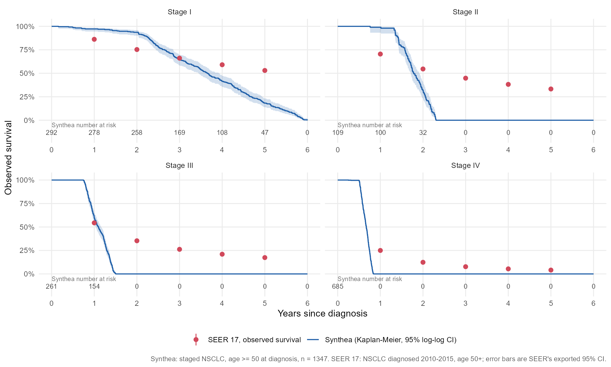

# Oncology RWE: NSCLC overall survival by stage and first-line treatment

**How realistic is synthetic oncology EHR data?** This project builds an NSCLC survival pipeline on synthetic EHR data (Synthea → OMOP CDM → dbt → R) and benchmarks it against 172,582 real U.S. patients from SEER, including a documented bug that made half of all synthetic lung cancers stage I. Synthea ranks the stages correctly, and its median survival for stage III nearly matches SEER (13 vs 14 months), but the shape of survival is wrong. Almost nobody in the synthetic cohort dies in the first months after diagnosis (7 of 1,347 within 6 months), and nobody with stage II–IV disease is alive after 28 months. Among the 160,258 real SEER patients with known stage, 33%, 17% and 4% of stage II, III and IV patients are alive at 5 years, and 5-year survival for stage I is 53%, against 18% in Synthea. Medians alone would have passed this data as realistic; the full curves show it can test a pipeline but not stand in for real-world outcomes.

*Synthea: staged NSCLC, age ≥50, n = 1,347. SEER 17: NSCLC diagnosed 2010–2015, age 50+, known stage, n = 160,258. Full table: results/km_synthea_vs_seer.csv.*

> **Data statement:** This project is built on **synthetic** patient-level EHR data (Synthea) and public cancer registry aggregates (SEER). It is structured to mirror commercial oncology EHR datasets. It is **not** Flatiron data. Synthea outcomes are simulated, so estimates are a methods demonstration, not clinical evidence.

## Research question
Among patients diagnosed with non-small cell lung cancer (NSCLC), how does real-world overall survival differ by stage at diagnosis and by first-line treatment type?

## Design
Retrospective cohort. Index date = first recorded lung cancer diagnosis. Adults with at least one encounter after index.
Exposures: stage; first-line treatment (chemotherapy alone, chemo + radiation, none recorded).
Outcomes: overall survival (censored at last recorded activity); time to next treatment.
Covariates: age, sex, smoking history, comorbidity count, diagnosis year.

## Pipeline
1. Synthea -> OMOP CDM 5.4 (ETL-Synthea) -> PostgreSQL; OHDSI Data Quality Dashboard
2. dbt models (`stg_`, `int_`, `mart_nsclc_cohort`) + tests
3. Rule-based lines of therapy
4. Endpoints
5. KM, Cox, IPTW, sensitivity analyses (R)
6. SEER benchmark

## Data note: Synthea stage assignment (finding and patch)

**Finding.** In an unmodified Synthea run (`master-branch-latest`, jar built 2026-08-18, seed 2026, ages 50-90, 20,000 patients) every lung cancer case was **stage 1**: 535 NSCLC and 98 small cell, none at stages 2-4. A stage comparison and a stage-level SEER benchmark are impossible on that output.

**Why.** In `lung_cancer.json`, the state `Schedule Follow Up III` assigns stage from the attribute `lung_cancer_nondiagnosis_counter` (Stage I if <= 36, II if <= 72, III if <= 108, otherwise IV). The counter increments once per loop in `Undiagnosed_Lung_Cancer`, where a patient has a 20% chance of seeking care each pass. The chance of exceeding 36 passes is about 0.8^36, roughly 0.03%, so nearly everyone is stage I. Separately, survival is scripted by stage in the module (stage I death 2-6 years after diagnosis, stage IV 6-10 months), so survival differences by stage are built in, not discovered.

**What changed.** Only that one state, in the local override [`synthea/modules/lung_cancer.json`](synthea/modules/lung_cancer.json), loaded with `-d synthea/modules` (`lung_cancer.json` and `veteran_lung_cancer.json`). The `conditional_transition` on the counter was replaced by an explicit `distributed_transition` using SEER-derived shares:

| Stage | SEER share (reported) | Share used in module |
|---|---|---|
| I | 20.0% | 20.02% |
| II | 8.4% | 8.41% |
| III | 19.8% | 19.82% |
| IV | 51.7% | 51.75% |

The reported shares sum to 99.9% because of rounding, so they are scaled proportionally to sum to 1 (Synthea requires it).

**Source of the shares.** SEER Research Data, 17 Registries, Nov 2025 Sub (SEER*Stat; National Cancer Institute, DCCPS, Surveillance Research Program): NSCLC diagnosed 2010-2015, age 50+, first primary only, AJCC 7th edition derived stage group; n = 160,258 with known stage. Unknown stage is excluded from the mix. Full citation and notes are in [`seer/`](seer/). The same shares apply to the small cell branch because the state is shared; small cell is excluded from the cohort. Nothing else in the module (treatment, death timing) was altered. The same edit is applied to `veteran_lung_cancer.json` (see below). (Earlier iterations used a 20/5/25/50 placeholder and then an interim SEER pull; both are superseded.)

**Consequences to keep in mind.** Because the stage mix is set from SEER, agreement with SEER on stage mix is by construction; the benchmark is informative about survival by stage, not stage distribution. SEER's 9.5% unknown stage is not reproduced in the synthetic data (every synthetic patient has a stage), so missing-stage sensitivity analyses will use simulated missingness. Synthea uses TNM stage 1-4 and SEER derived AJCC 7th stage groups collapse to the same four labels, so no summary-stage (Localized/Regional/Distant) mapping is needed for this benchmark.

**Second stage path: the veteran module (found after the first 60k run).** Patching `lung_cancer.json` alone was not enough. Synthea also runs `veteran_lung_cancer.json` for patients with the `veteran` attribute, and that module carries its own copy of the original counter rule (all stage I). The first 60k run (both modules at the time: patched `lung_cancer.json`, unpatched veteran module) therefore missed the SEER input:

| First run, veteran module unpatched (n = 1,584 staged NSCLC) | I | II | III | IV |
|---|---|---|---|---|
| Observed | **51.5%** | 5.8% | 11.6% | **31.1%** |
| SEER input | 20.0% | 8.4% | 19.8% | 51.7% |

The skew tracked the veteran path: men born 1930-1949 were 68% stage I; men born 1970 or later (mostly non-veterans) were 22 / 11 / 17 / 50%, close to the input. Stage I patients were about 13 years older than the others (median 67 vs 54), and the stage I share depended on diagnosis era (49% in the 2000s, 65% in the 2010s). Applying the same `distributed_transition` to the veteran module in a validation run (8,000 alive patients, 200 staged NSCLC) gave I 19.0% / II 13.5% / III 15.5% / IV 52.0%, close to the input. A full 60,000-patient run was then regenerated with both modules patched (`synthea/modules/lung_cancer.json` and `synthea/modules/veteran_lung_cancer.json`) and pinned `-r 20261001 -cs 2026`; its results are below.

**Analysis run, both modules patched** (86,734 records: 60,000 alive, 26,734 dead; 1,886 with a lung cancer diagnosis: 1,622 NSCLC, 264 small cell only; 1,621 NSCLC staged). Stage mix against the SEER input:

| | n | I | II | III | IV |
|---|---|---|---|---|---|
| SEER input (reported) | | 20.0% | 8.4% | 19.8% | 51.7% |
| All staged NSCLC | 1,621 | 21.8% | 7.4% | 19.2% | 51.5% |
| Age >= 50 at diagnosis (SEER cohort definition) | 1,347 | 21.7% | 8.1% | 19.4% | 50.9% |
| Diagnosed 2010-2015 | 339 | 22.1% | 8.3% | 17.7% | 51.9% |

Chi-square against the input: p = 0.18 (all), 0.50 (age >= 50), 0.68 (2010-2015). Stage II is consistent with the 8.4% input in every slice (7.4%, 95% CI 6.2-8.8 overall; 8.1%, CI 6.8-9.7 for age >= 50), so the 13.5% seen in the 200-patient validation run was sampling noise. The stage mix no longer varies by sex (F 21/8/19/51, M 22/7/19/52) or materially by era. Full output: [`synthea/evidence/run2_summary.txt`](synthea/evidence/run2_summary.txt). 274 staged NSCLC patients (17%) were diagnosed under age 50, because Synthea's 50-90 range applies to age at the reference date, not at diagnosis.

**Evidence retained.** The first run's lung-cancer-filtered export is kept locally (not committed; 1.2 GB) as `evidence_run1_lc_unpatched_veteran`, and its full summary table is committed at [`synthea/evidence/run1_summary.txt`](synthea/evidence/run1_summary.txt) (stage mix, 95% CIs, chi-square vs input, diagnosis-year distribution, sex and age by stage). That run is **not used for analysis**.

**Storage note.** Synthea's claims and imaging exports are excluded, and each export is filtered to patients with a lung cancer diagnosis (`tools/filter_lung_cancer.py`) before the OMOP ETL, because the full export is tens of gigabytes. The study cohort is lung cancer patients only, so the cohort is unchanged; the OHDSI Data Quality Dashboard therefore describes this filtered population.

Generation is reproducible with `synthea/run_generate.ps1` (population 60,000, seed 2026).

## Analysis cohort and sensitivity analysis
Decided 2026-10-01, after the stage mix was verified against SEER (counts from the analysis run, `-s 2026 -cs 2026 -r 20261001`):

**Definitions**

| Cohort | Definition |
|---|---|
| All staged NSCLC | NSCLC with a TNM stage code |
| **Main analysis** | Staged NSCLC, **age ≥50 at diagnosis**, all diagnosis years; follow-up **censored at 120 months** |
| **Sensitivity analysis** | Main cohort restricted to **diagnosed 2010–2015** |

**Characteristics**

| Cohort | n | Male | Age at dx, mean (SD) | Stage I | Stage II | Stage III | Stage IV |
|---|---:|---:|---:|---:|---:|---:|---:|
| All staged NSCLC | 1,621 | 74.9% | 60.8 (9.8) | 21.8% | 7.4% | 19.2% | 51.5% |
| **Main analysis** | **1,347** | 76.6% | 63.5 (8.6) | 21.7% | 8.1% | 19.4% | 50.9% |
| **Sensitivity analysis** | **305** | 81.6% | 65.9 (7.2) | 21.6% | 9.2% | 18.4% | 50.8% |
| *SEER input (for reference)* | *160,258* | | | *20.0%* | *8.4%* | *19.8%* | *51.7%* |

Notes:
- The age >= 50 rule matches the SEER pull and removes 274 staged NSCLC patients diagnosed younger (Synthea's 50-90 range applies to age at the reference date, not at diagnosis). The 2010-2015 window matches the SEER diagnosis years. (339 patients were diagnosed 2010-2015 before the age rule; 305 after.)
- The 120-month censoring rule is a protocol choice made up front. In this data it censors nobody: no staged NSCLC patient has more than 120 months of observed follow-up (1,563 of 1,621 died, and survivors are observed for a short time). It is kept so the analysis is specified before results are seen and does not depend on the simulation's follow-up.
- In the sensitivity cohort every patient died within 120 months, so there is no censoring there; survival estimates reduce to the observed death times.

**Synthea fidelity findings (to compare against SEER, not errors to fix).** The synthetic NSCLC cohort is about three-quarters male (74.9% of all staged; 76.6% in the main cohort) with mean age at diagnosis about 61 (60.8 all staged; 63.5 in the main cohort, because the age rule removes the youngest). These come from Synthea's demographic and risk model, not from the stage patch. They will be compared with the sex and age distribution from the SEER pull (survival by stage, age group and sex) in the benchmark, and reported as a representativeness limitation of the synthetic data. They are not adjusted or corrected.

## Software versions and provenance

| Component | Version / detail |
|---|---|
| Synthea | `master-branch-latest` release, `synthea-with-dependencies.jar`, build version `d9d07a6`, built 2026-08-18 (JDK 17.0.20). Local module override via `-d synthea/modules` |
| Synthea run (60k, analysis run) | `-s 2026 -cs 2026 -r 20261001 -p 60000 -a 50-90 -d synthea/modules`, location Massachusetts (default), CSV export only (claims and imaging excluded); both lung cancer modules patched. `run_generate.ps1` defaults to these values |
| ETL-Synthea (`ETLSyntheaBuilder`) | R package 2.1, installed from `OHDSI/ETL-Synthea` HEAD, commit `9ee6eb1b933c70af7b80711332aa92327af1f7c5` (2026-10-01); CommonDataModel 1.0.1 (`4a91030`) |
| OMOP CDM / Synthea table schema | CDM 5.4; Synthea table definitions `v330` (ETL-Synthea's newest) |
| OMOP vocabularies | Athena release v20260829: SNOMED, RxNorm, LOINC, CVX, ICDO3, Cancer Modifier plus Athena defaults; CPT4 excluded |
| Database | PostgreSQL 17, schemas `native`, `cdm`, `results`, `dbt` |
| R | 4.6.1; DatabaseConnector 7.2.0, SqlRender 1.19.7, survival 3.8.6, WeightIt 2.1.0, cobalt 5.0.0, mice 3.19.0 |
| dbt | dbt-postgres (dbt-core 1.12.5) |

**Version mismatch fix (NPI column).** The current Synthea export adds an `NPI` column to `organizations.csv` and `providers.csv` that the `v330` native tables in ETL-Synthea do not have. ETL-Synthea's own `LoadSyntheaTables()` also read ZIP codes as integers (losing leading zeros) and failed on `organizations.csv`. `etl/02a_load_native_copy.sh` replaces it: it loads each CSV with `psql \copy`, and when a CSV has columns the native table lacks it loads through a staging table and drops the extra columns (here only `NPI`, which is not used by the OMOP mapping). The OMOP mapping steps are run by `etl/02_etl_synthea.R` through a staged loader rather than ETL-Synthea's unmodified functions; see [`docs/provenance.md`](docs/provenance.md) for what changed and why.

**Reproducibility.** The analysis run pins the patient seed (`-s 2026`), the clinician seed (`-cs 2026`) and the reference date (`-r 20261001`, i.e. 2026-10-01 00:00 UTC), so it can be regenerated with `synthea/run_generate.ps1` using the same jar and modules. The clinician seed affects provider assignment only, not clinical outcomes (diagnoses, stage, treatment, death), which are driven by the patient seed and the modules. The first (superseded) 60k run did not pin the reference date or clinician seed (it used the clock: reference time 1790875995187, 2026-10-01 13:33:15 -04:00); that run is retained only as evidence for the veteran-module finding. Generated data are not committed (only settings, modules and code).

**Filtering and "deaths".** Before the ETL each export is filtered to patients with a lung cancer diagnosis (`tools/filter_lung_cancer.py`). Every patient-keyed table is filtered on the same patient IDs; `organizations`, `providers` and `payers` are copied whole. Verified on the 20k export: 633 patients, and each of encounters, conditions, medications, procedures, observations, careplans, immunizations, devices, supplies and payer_transitions has rows for all 633 (allergies for the 80 who have any) with zero patient IDs outside the cohort. Synthea has no separate deaths table: death is `patients.DEATHDATE`, mapped to the OMOP `death` table by the ETL.

Further ETL notes (the stage III small-cell vocabulary mapping, the skipped `drug_era` step, the extra-index timing test and the OMOP verification results) are in [`docs/provenance.md`](docs/provenance.md).

## License and data terms
The **MIT License** (see [LICENSE](LICENSE)) covers **the code in this repository only**: the scripts, SQL/dbt models, R code, Synthea module edits and documentation I wrote.

It does **not** cover third-party data or content:
- **SEER data** are used under the SEER Research Data Use Agreement. No SEER record-level data are in this repository; only the small set of aggregate results listed in [`seer/`](seer/) is included, and SEER data cannot be redistributed.
- **OMOP standardized vocabularies** (downloaded from Athena) remain under their own terms and the licences of each source vocabulary (for example SNOMED CT, RxNorm, LOINC, CVX, ICDO3). They are not included here and are not redistributed.
- **Synthea** is open source under its own license; the generated synthetic data are not committed (only generation settings and the edited module files).

## Status
Kaplan–Meier comparison with SEER complete. Next: SEER age and sex by stage pull, OHDSI Data Quality Dashboard, lines of therapy.

## Running the code
Run everything from the repository root.
1. Copy [`.Renviron.example`](.Renviron.example) to `.Renviron` (gitignored) and set the PostgreSQL connection, a JDK 17+ `JAVA_HOME`, and the vocabulary/Synthea paths.
2. Create the database and role: `etl/setup_postgres.ps1`.
3. Generate the synthetic data: `synthea/run_generate.ps1`.
4. Keep only lung cancer patients: `tools/filter_lung_cancer.py <csv_dir> <out_dir>`.
5. Load the OMOP vocabularies: `etl/01_load_vocab.R`, then `etl/01b_load_vocab_copy.sh` and `etl/01c_vocab_indexes.sql`.
6. Load the Synthea CSVs: `etl/02a_load_native_copy.sh <dir>`.
7. Map to OMOP CDM 5.4: `Rscript etl/02_etl_synthea.R`.
8. Check the cohort: `tools/cohort_summary.py <dir>`.

Further stages (dbt, analysis, report) are still to come.
