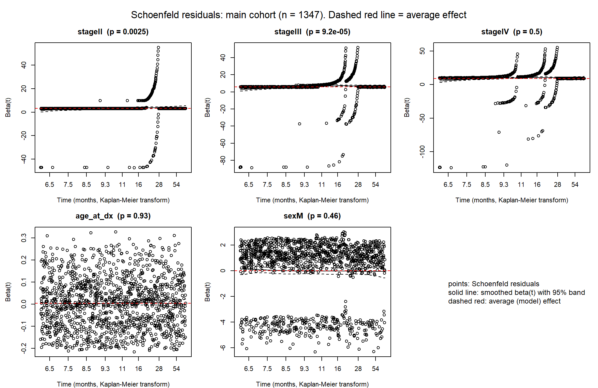

```{r setup, include = FALSE}
# The notebook lives in notebooks/, the project files live one level up. Pointing knitr at the repository root
# means every relative path below (".Renviron", "results/", "seer/", "figures/") works exactly as in the .R scripts.
knitr::opts_knit$set(root.dir = normalizePath(".."))
knitr::opts_chunk$set(echo = TRUE, message = FALSE, warning = FALSE, comment = "#>")
suppressPackageStartupMessages(library(ggplot2))
```

## What this notebook does

Fits `coxph(Surv(followup_months, event) ~ stage + age_at_dx + sex)` on the main cohort, tests the proportional-hazards assumption with `cox.zph`, and repeats the fit
without patients flagged `prior_other_cancer` as a sensitivity analysis. First-line treatment is **not** modelled: 1,346 of 1,347 patients received the same treatment
(see `docs/analysis_decisions.md`), so there is no treatment contrast to estimate.

**Reading the results.** The stage hazard ratios (about 22, 290 and 9,490 against stage I) reflect near-complete separation of survival times by stage, because the generator scripts
death windows by stage. They are not clinical effect sizes. The proportional-hazards test rejects, as it should. Age and sex have essentially no effect in the synthetic data.

**Outputs:** `results/cox_os_hazard_ratios.csv`, `results/cox_os_ph_tests.csv`, `figures/cox_schoenfeld_residuals.png`, `figures/cox_schoenfeld_residuals_excl_prior_cancer.png`.

## Setup

Packages and output folders.

```{r}
suppressPackageStartupMessages({ library(DBI); library(RPostgres); library(survival); library(dplyr) })
options(width = 120, digits = 4)
dir.create("results", showWarnings = FALSE); dir.create("figures", showWarnings = FALSE)
```

## Load the cohort

Main cohort from the dbt mart, with stage and sex as factors (reference: stage I, female).

```{r}
if (!nzchar(Sys.getenv("PG_HOST"))) readRenviron(".Renviron")
con <- dbConnect(Postgres(), host = Sys.getenv("PG_HOST"), port = as.integer(Sys.getenv("PG_PORT")),
                 dbname = Sys.getenv("PG_DB"), user = Sys.getenv("PG_USER"), password = Sys.getenv("PG_PASSWORD"))
mart <- dbGetQuery(con, "select * from dbt.mart_nsclc_cohort")
dbDisconnect(con)
mart <- mart |> mutate(stage = factor(stage, levels = c("I", "II", "III", "IV")), sex = factor(sex, levels = c("F", "M")),
                       followup_months = as.numeric(followup_months), event = as.integer(event), age_at_dx = as.numeric(age_at_dx))
```

## Fit the models

`fit_one()` fits the Cox model, prints the summary, and runs `cox.zph` twice: once per term (stage as one 3-df term) and once per coefficient. It is run on the main cohort and on the cohort without prior other cancers.

```{r}
fit_one <- function(d, label) {
  cat("\n====", label, "====\n")
  cat(sprintf("n = %d, events = %d, censored = %d\n", nrow(d), sum(d$event), sum(1 - d$event)))
  fit <- coxph(Surv(followup_months, event) ~ stage + age_at_dx + sex, data = d)
  print(summary(fit))
  cat("\nProportional-hazards test (cox.zph, Schoenfeld residuals, transform = km), by term (stage tested as one 3-df term):\n")
  zph <- cox.zph(fit)
  print(zph)
  cat("\nSame test by coefficient (stage II, III and IV separately):\n")
  zph_c <- cox.zph(fit, terms = FALSE)
  print(zph_c)
  list(fit = fit, zph = zph, zph_c = zph_c, d = d)
}
main <- fit_one(mart, "MAIN: all main-cohort patients")
sens <- fit_one(filter(mart, !prior_other_cancer), "SENSITIVITY: excluding prior_other_cancer")
cat(sprintf("\nPatients flagged prior_other_cancer and excluded from the sensitivity fit: %d of %d\n", sum(mart$prior_other_cancer), nrow(mart)))
```

## Hazard ratios with 95% confidence intervals

Hazard ratios, intervals and p-values for every term, plus age per 10 years. The proportional-hazards test results are saved too, because the report quotes them.

```{r}
hr_table <- function(m, label) {
  s <- summary(m$fit)
  ci <- s$conf.int; co <- s$coefficients
  out <- data.frame(model = label, term = rownames(ci), hr = ci[, "exp(coef)"], lcl = ci[, "lower .95"], ucl = ci[, "upper .95"], p = co[, "Pr(>|z|)"], row.names = NULL)
  age10 <- exp(coef(m$fit)["age_at_dx"] * 10); se <- sqrt(vcov(m$fit)["age_at_dx", "age_at_dx"]) * 10
  rbind(out, data.frame(model = label, term = "age_at_dx (per 10 years)", hr = unname(age10), lcl = unname(exp(log(age10) - 1.96 * se)), ucl = unname(exp(log(age10) + 1.96 * se)),
                        p = unname(co["age_at_dx", "Pr(>|z|)"])))
}
hr <- rbind(hr_table(main, "main"), hr_table(sens, "excluding prior_other_cancer"))
write.csv(transform(hr, hr = signif(hr, 4), lcl = signif(lcl, 4), ucl = signif(ucl, 4), p = signif(p, 3)), "results/cox_os_hazard_ratios.csv", row.names = FALSE)
ph_table <- function(m, label) {                      # proportional-hazards tests, by term (stage as one 3-df term) and by coefficient
  one <- function(z, level) { tb <- z$table; data.frame(model = label, level = level, name = rownames(tb), chisq = tb[, "chisq"], df = tb[, "df"], p = tb[, "p"], row.names = NULL) }
  rbind(one(m$zph, "term"), one(m$zph_c, "coefficient"))
}
ph <- rbind(ph_table(main, "main"), ph_table(sens, "excluding prior_other_cancer"))
write.csv(transform(ph, chisq = signif(chisq, 4), p = signif(p, 3)), "results/cox_os_ph_tests.csv", row.names = FALSE)
cat("\n==== HAZARD RATIOS (95% CI); reference: stage I, female ====\n")
print(transform(hr, hr = signif(hr, 4), lcl = signif(lcl, 4), ucl = signif(ucl, 4), p = signif(p, 3)), row.names = FALSE)
cat(sprintf("\nConcordance: main %.3f (se %.3f); excluding prior_other_cancer %.3f (se %.3f)\n", concordance(main$fit)$concordance, sqrt(concordance(main$fit)$var),
            concordance(sens$fit)$concordance, sqrt(concordance(sens$fit)$var)))
```

## Chart: hazard ratios (forest plot)

Hazard ratios on a log scale, main cohort and the sensitivity analysis excluding prior other cancers. The dashed line is a hazard ratio of 1 (no effect). The stage hazard ratios are enormous because the stage curves hardly overlap; age and sex sit on the line.

```{r chart-forest, fig.width = 8, fig.height = 4.2}
labs_term <- c("stageII" = "Stage II (vs I)", "stageIII" = "Stage III (vs I)", "stageIV" = "Stage IV (vs I)",
               "age_at_dx (per 10 years)" = "Age (per 10 years)", "sexM" = "Male (vs female)")
fp <- hr |> filter(term %in% names(labs_term)) |>
  mutate(term = factor(labs_term[term], levels = rev(unname(labs_term))))
ggplot(fp, aes(hr, term, colour = model)) +
  geom_vline(xintercept = 1, linetype = 2, colour = "grey50") +
  geom_pointrange(aes(xmin = lcl, xmax = ucl), position = position_dodge(width = 0.5)) +
  scale_x_log10(breaks = c(0.5, 1, 2, 5, 20, 100, 1000, 10000),
                labels = scales::label_number(big.mark = ",", drop0trailing = TRUE)) +
  scale_colour_manual(NULL, values = c("main" = "#1f5fa8", "excluding prior_other_cancer" = "grey40")) +
  labs(x = "Hazard ratio (log scale), 95% CI", y = NULL) +
  theme_minimal() + theme(legend.position = "bottom", panel.grid.minor = element_blank())
```

## Chart: a visual check of proportional hazards

If hazards were proportional, the curves of log(-log S) against log(time) would be parallel. Here they are steep, converge and sit far apart: the assumption fails, as the test says. (Stage curves that have reached zero have no log(-log S) and are cut off.)

```{r chart-cloglog, fig.width = 8, fig.height = 4.5}
km_all <- survfit(Surv(followup_months, event) ~ stage, data = main$d)
sm <- summary(km_all, censored = FALSE)
cl <- tibble(stage = sub("stage=", "", as.character(sm$strata)), t = sm$time, S = sm$surv) |>
  filter(S > 0, S < 1, t > 0) |> mutate(cloglog = log(-log(S)))
ggplot(cl, aes(log(t), cloglog, colour = stage)) +
  geom_step(linewidth = 0.8) +
  scale_colour_viridis_d(name = "Stage", end = 0.9) +
  labs(x = "log(months since diagnosis)", y = "log(-log S(t))") +
  theme_minimal() + theme(panel.grid.minor = element_blank())
```

## Schoenfeld residual plots

One panel per coefficient: points are scaled Schoenfeld residuals, the solid line is the smoothed effect over time with its 95% band, and the dashed red line is the model's single average effect. Where the solid line departs from the dashed one, the proportional-hazards assumption fails.

```{r}
plot_zph <- function(m, file, title) {
  png(file, width = 10, height = 6.5, units = "in", res = 200, bg = "white")
  par(mfrow = c(2, 3), mar = c(4, 4.5, 3, 1), oma = c(0, 0, 2.5, 0))
  cf <- rownames(m$zph_c$table); cf <- cf[cf != "GLOBAL"]
  for (i in seq_along(cf)) {                                  # one panel per coefficient
    plot(m$zph_c[i], resid = TRUE, df = 4, main = sprintf("%s  (p = %s)", cf[i], format.pval(m$zph_c$table[cf[i], "p"], digits = 2)),
         xlab = "Time (months, Kaplan-Meier transform)", ylab = "Beta(t)")
    abline(h = coef(m$fit)[i], lty = 2, col = "red")
  }
  frame(); legend("center", bty = "n", cex = 1.1,
                  legend = c("points: Schoenfeld residuals", "solid line: smoothed beta(t) with 95% band", "dashed red: average (model) effect"))
  mtext(title, outer = TRUE, cex = 1)
  dev.off()
}
plot_zph(main, "figures/cox_schoenfeld_residuals.png", sprintf("Schoenfeld residuals: main cohort (n = %d). Dashed red line = average effect", nrow(main$d)))
plot_zph(sens, "figures/cox_schoenfeld_residuals_excl_prior_cancer.png", sprintf("Schoenfeld residuals: excluding prior_other_cancer (n = %d)", nrow(sens$d)))
```



## Session information

The packages and versions this notebook ran with.

```{r sessioninfo}
sessionInfo()
```
